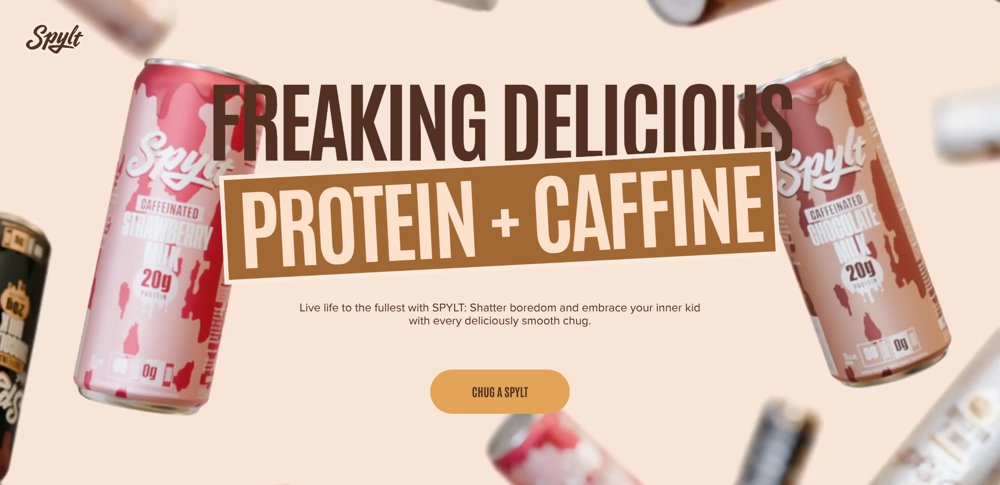
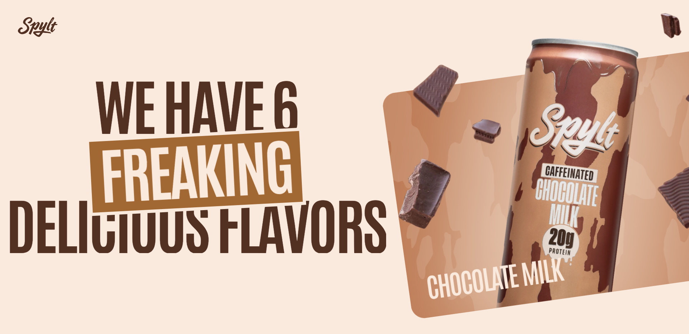

# Spylt

<table align="center">
  <tr>
    <td align="center">
      
    </td>
    <td align="center">
      
    </td>
  </tr>
</table>

## This project is:

This is a full GSAP project with smooth animations, intro and scrolling effects.

# Visit link:
<a href="https://spylt-one-phi.vercel.app/">
[Visit here]
</a>

## Getting Started

First, run the development server:

```bash
npm install
# then
npm run dev
# or
yarn dev
# or
pnpm dev
# or
bun dev

# Libraries used in this project:
# Lenis: (Smooth scrolling and yeah you can use scroll trigger of GSAP too)
npm i lenis

# GSAP:
npm i gasp @gsap/react
```
